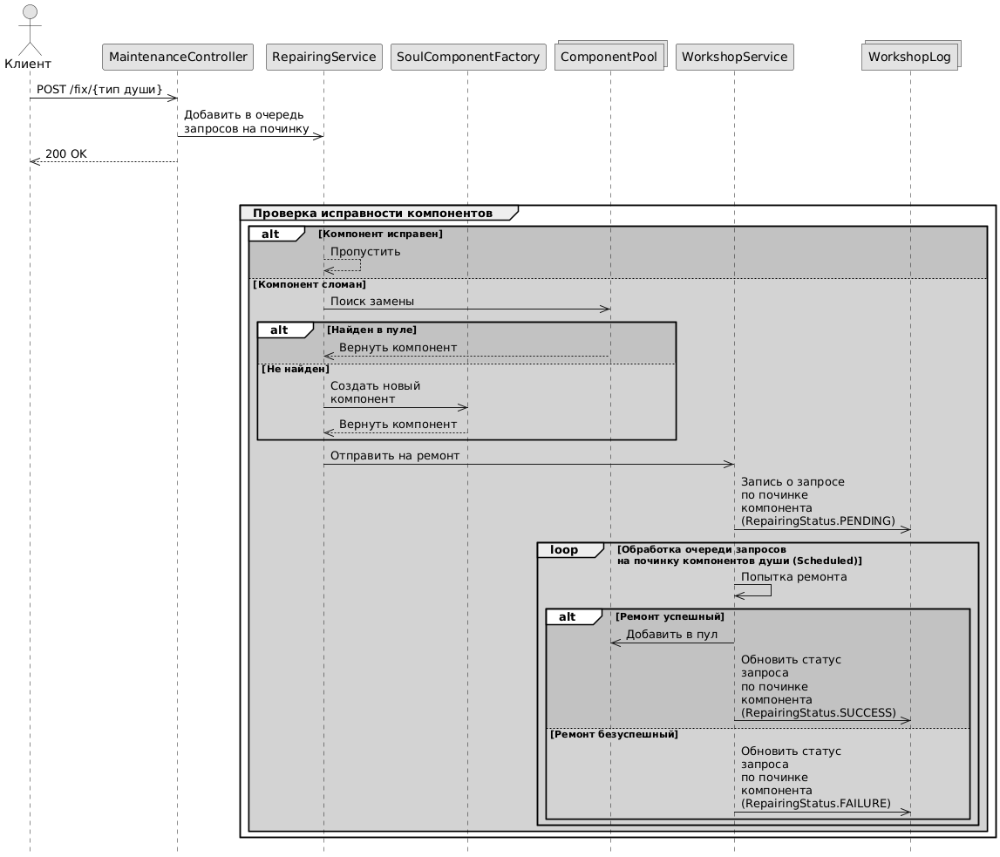

Смоделируйте систему “сервисный центр”. В СЦ могут обращаться
клиенты с запросами на ремонт техники (вид техники выберите
самостоятельно) (запросы могут поступать не последовательно). При
ремонте может понадобиться замена некоторых компонентов, которые
должны быть запрошены из пула, а при их отсутствии - компоненты
необходимо произвести на базе существующих “чертежей” (примените
паттерны проектирования “абстрактная фабрика”, “одиночка” (для
фабрики) и “прототип”). При замене компонентов, сломанные компоненты
отправляются “в мастерскую” (отдельный сервис) для ремонта (ремонт
занимает некоторое количество времени) и при успешном ремонте
помещаются в пул, а при неуспешном - отправляются на утилизацию.
Механики ремонта, утилизации, поступления новых клиентов определите
самостоятельно. Для модели реализуйте фасад, позволяющий получать:
состояние пула, активные запросы клиентов, состояние мастерской,
информацию об утилизированных компонентах. Время в системе
дискретно. Начальные настройки частей системы должны быть
псевдослучайными. Продемонстрируйте работу системы. Обеспечьте
наглядный вывод информации о процессе работы и результатах работы
системы.

